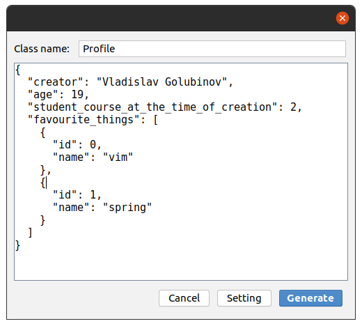

## Introduction

An IntelliJ Idea plugin for generating Lombok POJO or Vanilla POJO from JSON 

## Dependency
https://github.com/vdlald/json2pojo

## Screenshot's




## Result

```java
import com.fasterxml.jackson.annotation.JsonProperty;
import java.lang.Double;
import java.lang.String;
import java.lang.SuppressWarnings;
import java.util.List;
import lombok.AllArgsConstructor;
import lombok.Data;
import lombok.NoArgsConstructor;

@Data
@NoArgsConstructor
@AllArgsConstructor
@SuppressWarnings("unused")
public class Profile {
    private String creator;

    private Double age;

    @JsonProperty("student_course_at_the_time_of_creation")
    private Double studentCourseAtTheTimeOfCreation;

    @JsonProperty("favourite_things")
    private List<FavouriteThings> favouriteThings;

    @Data
    @NoArgsConstructor
    @AllArgsConstructor
    @SuppressWarnings("unused")
    public static class FavouriteThings {
        private Double id;

        private String name;
    }
}
```
